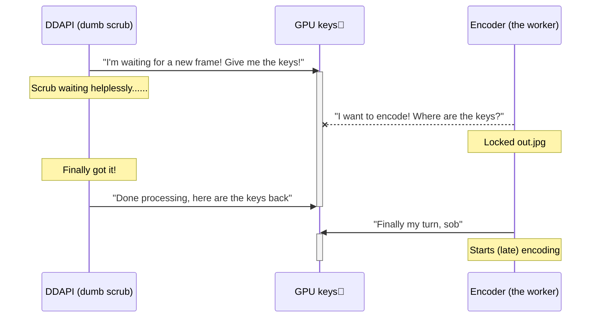
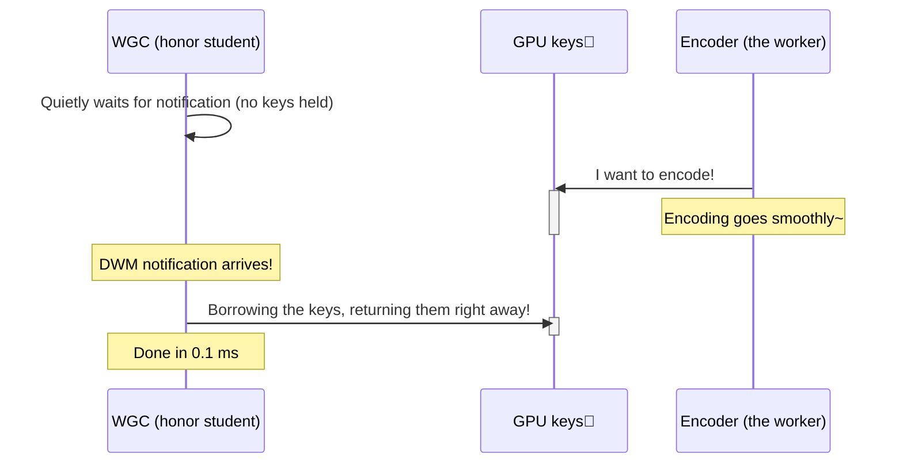
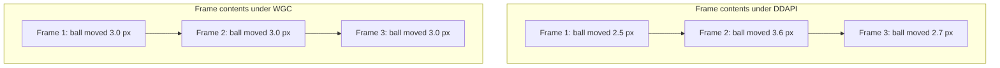
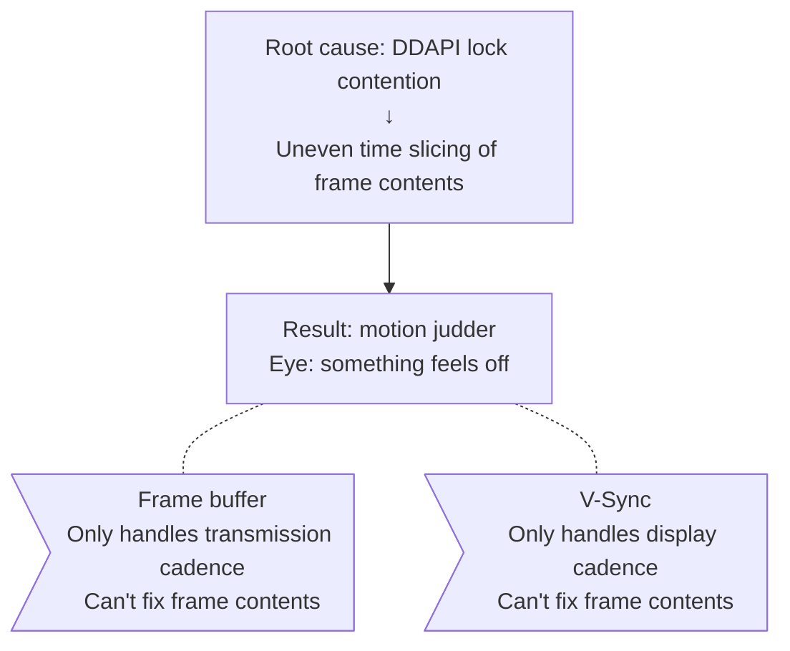

# Hey scrub! Still using DDAPI? WGC vs DDAPI smoothness showdown!

> Scrub, scrub~ what a scrub who can't even pick a capture mode~
> This article explains, in terms even a scrub can understand, why WGC is way smoother than DDAPI!

---

## Wait — same frame rate, but the picture isn't equally smooth?

Have you scrubs ever noticed, while streaming with Sunshine — both are set to 60fps, but WGC just *looks* smoother than DDAPI?

"It's just my imagination, right?" — nope, scrub! There's an actual technical reason!

---

## First, let's clear this up: how does your game image get into the stream?

Even a scrub knows the picture doesn't appear out of thin air, right? The pipeline goes like this:


**DWM** (Desktop Window Manager) is the Windows housekeeper that composites all your windows into the final desktop image. No matter what capture method you use, you're ultimately grabbing the picture from DWM.

But! **How** you grab the picture from DWM is wildly different between the two methods —

---

## DDAPI: the dim-witted waiter

The way DDAPI works, by analogy:

> Scrub DDAPI runs over to DWM's door every so often and asks, "Got a new frame? Got a new frame?"
> DWM: "Not yet! Wait!"
> DDAPI: "OK… I'll just stand here and wait…"
> **And then it really does just stand there and not move!**
> Worse — **while it's waiting it's still gripping the GPU's keys in its hand and won't let go!**



See that?! The encoder *wants* to work, but DDAPI, that scrub, blocks it at the door!

---

## WGC: the honor student's way of doing things

WGC is way smarter —

> WGC: "Master DWM, please give me a heads-up when there's a new frame~"
> DWM: "Sure."
> WGC sits back at its desk and waits quietly for the notification, **occupying no shared resources in the meantime**
> DWM: "New frame is ready!"
> WGC: "Got it! I'll just borrow the GPU keys for a moment and give them right back~"



The encoder is unaffected the whole time! It can use the GPU whenever it wants!

---

## So what's the actual difference?

| | DDAPI (scrub) | WGC (honor student) |
|---|---|---|
| Frame fetching | Dumbly polls and waits | Cleverly waits for a callback notification |
| Time spent holding the GPU keys | The entire wait period | Only for a moment while copying the texture |
| Can the encoder do its job? | Often locked out | Unobstructed |
| Frame interval stability | Wobbles a lot (±3–4 ms) | Very stable (±0.5 ms) |
| How it feels | A bit rough (no, not *that* kind of rough) | Silky smooth~ |

---

## Wait! My client has frame buffering and V-Sync enabled! Why can I still feel it?

Good question, scrub (rare!).

V-Sync does ensure that every frame stays on the screen for exactly the same **duration** — 16.67 ms each. Frame buffering does smooth out network jitter.

**But!** The problem is not "when frames are delivered," but "what's *inside* each frame"!

Take this example — imagine a ball moving across the screen at constant speed:



Because the encoder gets delayed under DDAPI, **each frame contains a different amount of in-game motion** — one frame the ball walked 2.5 pixels, the next it walked 3.6.

V-Sync makes every frame display for the same duration (16.67 ms), but what your eye *sees* is: **the ball moving in fits and starts**.

This thing has a proper name: **judder** (motion jitter). It's not dropped frames, it's not stutter — it's that "I can't quite say what's wrong, but it's just not smooth" feeling.

### A scrub-friendly analogy

Imagine you're sitting in a smoothly moving bus, watching the streetlights pass by:
- **WGC**: the streetlights are perfectly evenly spaced. Looks great~
- **DDAPI**: the streetlight spacing is uneven. After a while you start feeling sick…

V-Sync guarantees "you see the same number of streetlights per second," and the frame buffer guarantees "no streetlight suddenly disappears," but **the spacing between them is uneven** — that was decided when the lights were planted, and nothing downstream can fix it.



---

## The higher the frame rate, the worse it gets, scrub~

| Frame rate | Frame interval | DDAPI's ±3 ms jitter as % | What you feel |
|---|---|---|---|
| 30 fps | 33.3 ms | 9% | A little rough |
| 60 fps | 16.7 ms | 18% | Noticeably not smooth |
| 120 fps | 8.3 ms | **36%** | Pretty uncomfortable |
| 240 fps | 4.2 ms | **72%** | Scrub, are you here for the comedy? |

The higher the frame rate, the larger that same 3 ms jitter looms, and the more obvious the judder becomes. So all you scrubs chasing high-frame-rate streaming — **use WGC!**

---

## So is DDAPI completely useless?

Not exactly~ (consoling the scrub)

- **Legacy compatibility**: Windows 10 versions before 1903 don't have WGC, so DDAPI is the only option.
- **Certain edge cases**: a few apps can't be captured by WGC but work fine with DDAPI.
- **Sunshine is already optimizing**: it uses a "short timeout + intermittent lock release" strategy to mitigate the lock contention.

But if your system supports WGC…

> **Scrub! Go switch to WGC right now! Don't sit there hesitating!**

---

## TL;DR (a reward for the scrubs who made it this far)

```
Smoothness = how evenly frames are delivered × how evenly frame contents are spaced
                       ↑                                ↑
                  V-Sync handles                  WGC ✓  DDAPI ✗
```

| One-liner takeaway |
|---|
| WGC is event-driven and doesn't grab the GPU lock → the encoder is never delayed → even frame intervals → silky smooth |
| DDAPI hogs the GPU lock while waiting → the encoder is starved → uneven frame intervals → judder |
| Frame buffering and V-Sync can't touch frame contents → judder is decided on the server side → the client can't save you |

> So, scrub~ go change your capture mode to WGC in the settings already~?
